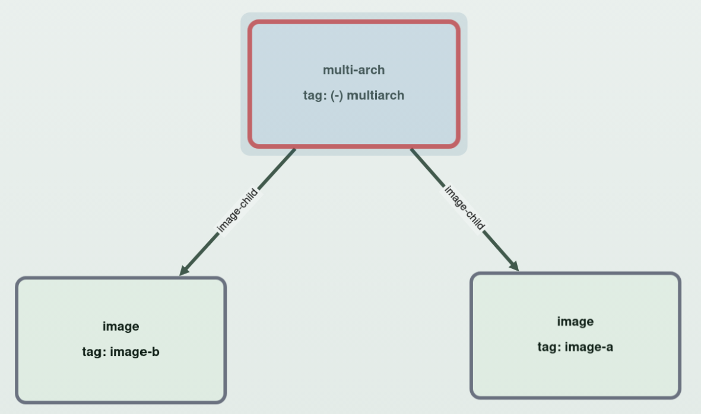

# Matrix Workflow To Visualizer

This document explains how to go from a live workflow run to local graph inspection in
`ghcr-cleanup-manager-visualizer`.

Related docs:

- [Scenarios](scenarios.md)
- [Test Package Setup](package-setup.md)
- [ghcr-cleanup-manager-visualizer](../../visualizer/README.md)

## Purpose

Use this flow when you want to:

- run the live scenario matrix on a fork
- download the merged SQLite DB artifact from that run
- inspect before/after cleanup state locally in the visualizer

## Run A Matrix Workflow

The main matrix workflows are:

- `.github/workflows/test_scenario-graph-matrix.yml`
- `.github/workflows/test_scenario-executor-matrix.yml`

There is also a single-scenario workflow:

- `.github/workflows/test_scenario-executor.yml`

### Prerequisites

Use a fork or another repository checkout where you can run GitHub Actions with workflow dispatch.

You also need the live test package configuration described in [Test Package Setup](package-setup.md):

- `GH_TEST_ORG`
- `GH_TEST_PAT_USERNAME`
- `GH_TEST_PAT`

### Running The Workflow

Open the Actions tab and start the workflow with `Run workflow`.

Common input notes:

- `executors` limits which executor lanes are included
- `upload_artifacts` should stay enabled if you want the merged SQLite DB at the end
- `artifact_retention_days` is optional

Typical choices:

- graph-focused inspection:
  - run `Test: Scenario Graph Matrix`
- older mixed cleanup surface:
  - run `Test: Scenario Executor Matrix`
- one focused reproduction:
  - run `Test: Scenario Executor`

## Download The DB Artifact

When the matrix workflow finishes, it uploads one merged SQLite DB artifact for the run.

Download that `.sqlite` file to your local machine.

## Start The Visualizer

Install the visualizer:

```sh
npm install --global ghcr-cleanup-manager-visualizer
```

> Requirement: Node.js `24` or newer.

Run it against the downloaded DB:

```sh
ghcr-cleanup-manager-visualizer --db ./downloaded-run.sqlite
```

The command prints a local URL such as:

```text
Visualizer listening at http://127.0.0.1:43217
```

Open that URL in your browser.

## Open A Scenario Package

Inside the visualizer:

1. choose the owner
2. choose the package
3. leave the scan selectors at their defaults unless you want a different comparison
4. type part of a tag into the lookup field
5. pick the matching tag suggestion

Good search terms to start with in many scenarios:

- `image`
- `multiarch`
- `keep`
- `delete`

The package selector is usually enough to identify the scenario because the package name includes:

- the scenario ID
- the executor suffix

## Before/After Compare Defaults

When a package has at least two completed scans, the visualizer defaults to:

- main scan: the older of the newest two scans
- compare scan: the newest scan

For scenario packages this usually means:

- main scan: the pre-cleanup scan
- compare scan: the post-cleanup scan

So in many cases you can open a package and immediately inspect the before/after delta without manually choosing scan
IDs.

If you need a different comparison, change the scan selectors explicitly.

## Reading The Delta

See [ghcr-cleanup-manager-visualizer](../../visualizer/README.md) for the exact delta markers used in compare mode.

In practice, search for any of the scenario's tags to load the graph and inspect which manifests or tags disappeared.


