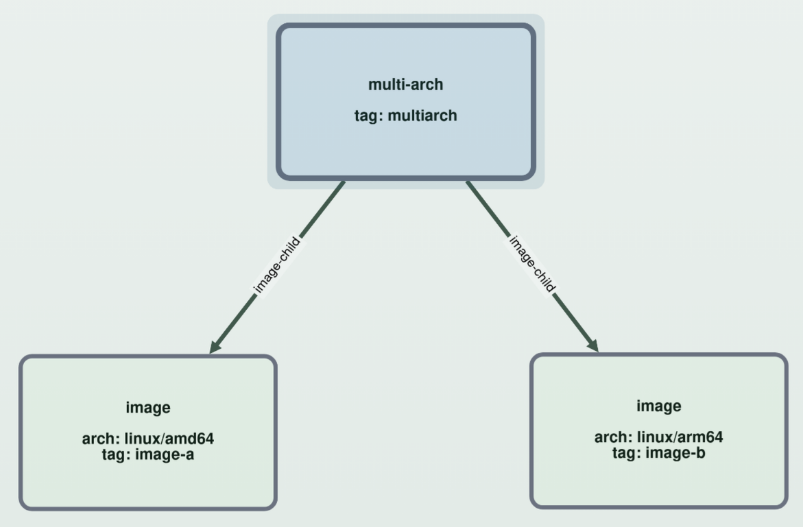
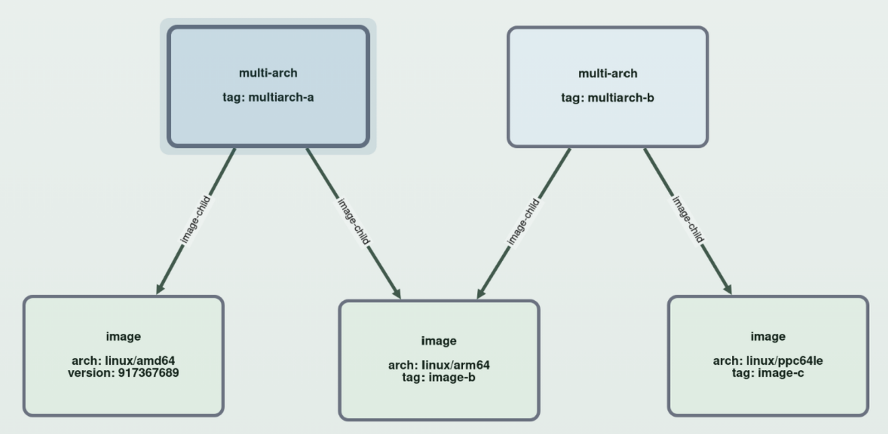
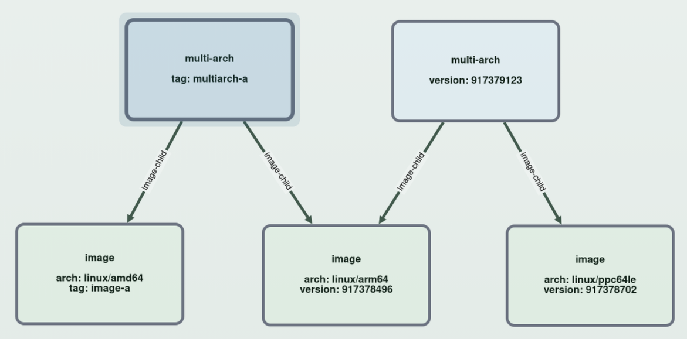
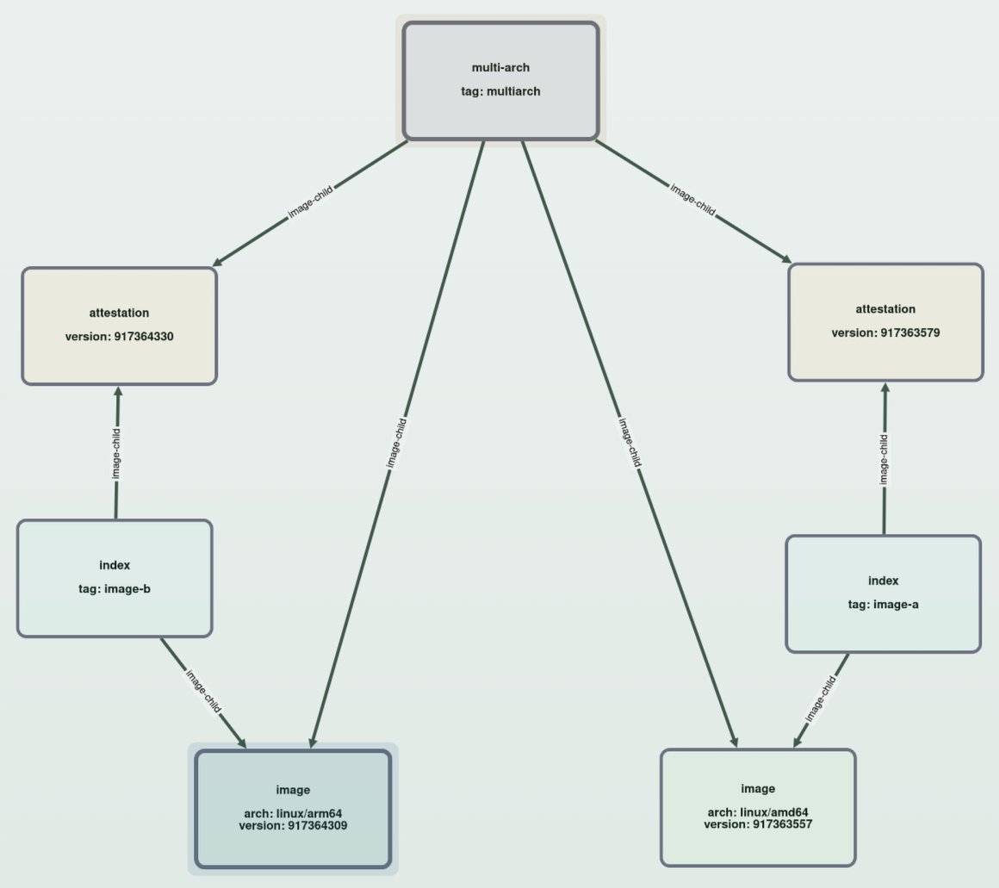
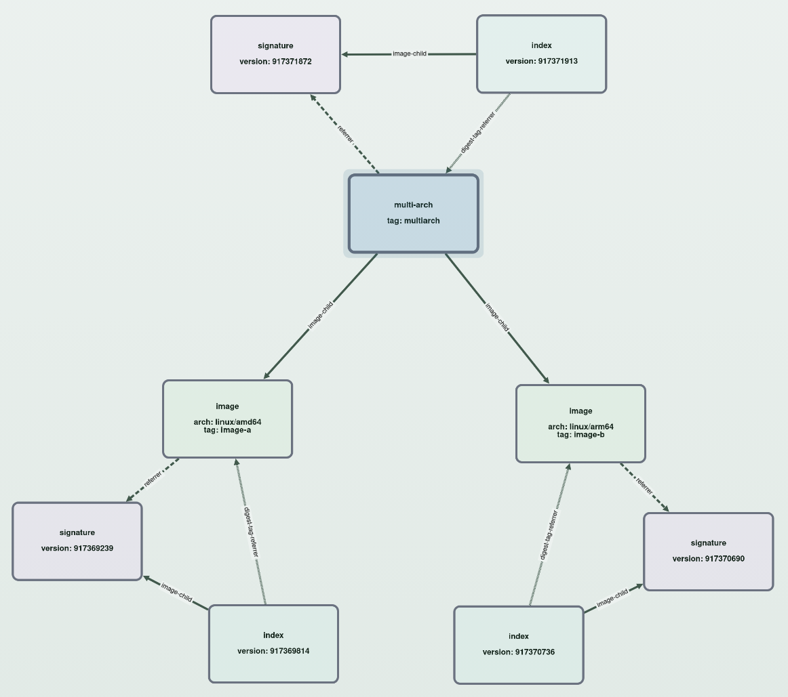
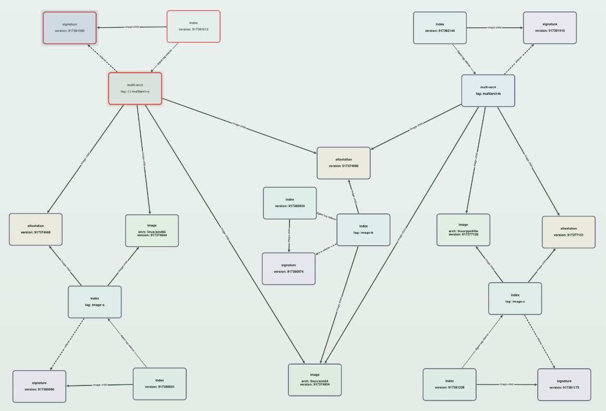

# Scenarios

This document gives a basic map of the live GHCR test scenarios used by `ghcr-manager`.

Related docs:

- [Test Package Setup](package-setup.md)
- [Matrix Workflow To Visualizer](matrix-workflow-to-visualizer.md)
- [Visualizer](../../visualizer/README.md)

## Graph Scenarios

Graph scenarios live in `tools/tests/test-scenarios/_graph-scenarios.mjs` and are seeded by
`tools/tests/seed-graph-matrix-scenario.mjs`.

They are the most regular live scenarios in the repository. The intent is to build graph shapes step by step so the
effect of each cleanup operation is easier to inspect in the DB and in the visualizer.

### Base Layouts

All graph scenarios start with one extra tagged image:

- `keep-dummy`

That tag is not the target of any cleanup operation. GitHub errors when deleting the last tag in a package, this dummy
prevents those errors.

The main base layouts are:

#### `1image`

- `image-a`: one single-platform image tag

This is the smallest graph scenario. There is no multi-arch manifest here.

#### `2images`

- `image-a`: one single-platform image tag
- `image-b`: one single-platform image tag
- `multiarch`: one multi-arch manifest that points at `image-a` and `image-b`

This is the first graph layout where one tagged multi-arch manifest overlaps tagged image manifests.

#### `2multiarch`

- `image-a`: single-platform image tag
- `image-b`: single-platform image tag
- `image-c`: single-platform image tag
- `multiarch-a`: multi-arch manifest over `image-a` and `image-b`
- `multiarch-b`: multi-arch manifest over `image-b` and `image-c`

This introduces a shared platform image between two tagged multi-arch manifests: `image-b` is used by both `multiarch-a`
and `multiarch-b`.

### `2multiarch2tags`

`2multiarch2tags` starts from the same underlying graph shape as `2multiarch`, but removes some of the direct root tags.

Tagged roots kept in this variant:

- `image-a`
- `multiarch-a`

This makes it easier to study cases where the package still contains the larger multi-arch structure, but only a smaller
subset is directly tagged.

### Extensions

Each base layout exists in four forms:

- `base`
- `attestations`
- `cosign`
- `cosign-attestations`

#### `base`

No extra attestations or cosign signatures are added beyond the image and index manifests needed for the layout itself.

#### `attestations`

Each pushed image is built with provenance enabled.

That adds OCI attestation manifests for the image tags. In the visualizer this makes the graph deeper without changing
the visible tag layout.

#### `cosign`

Cosign signatures are added for:

- the tagged image digests
- the leaf image digests used under multi-arch indexes
- the multi-arch manifest digests

This adds signature manifests and cosign tags around the image and multi-arch manifests.

#### `cosign-attestations`

This combines both of the above:

- image attestations are present
- cosign signatures are present

This is the densest graph form in the graph scenarios.

### Cleanup Operations

Each graph cleanup variant applies one of a small number of cleanup operations to the seeded graph.

#### Delete one image tag

Examples:

- `graph-1image-base--delete-image-a`
- `graph-2images-base--delete-image-a`
- `graph-2multiarch-base--delete-image-a`

Cleanup request:

- delete one directly tagged image root

This is useful for checking what else stays reachable through other tags and what becomes deletable.

#### Delete one multi-arch tag

Examples:

- `graph-2images-base--delete-multiarch`
- `graph-2multiarch-base--delete-multiarch-a`
- `graph-2multiarch2tags-base--delete-multiarch-a`

Cleanup request:

- delete one directly tagged multi-arch root

This is useful for checking how child images, shared children, attestations, and signatures behave once the tagged
wrapper manifest is selected for cleanup.

#### Delete both

Examples:

- `graph-2images-base--delete-image-a-and-multiarch`
- `graph-2multiarch-base--delete-image-a-and-multiarch-a`

Cleanup request:

- delete one tagged image root
- delete one tagged multi-arch root

These are the broadest graph cleanup variants in the matrix because they remove both a direct tagged image and one of
the wrapping multi-arch manifests in the same run.

## User-Owned Package Test

Workflow:

- `.github/workflows/test_user-owner-cleanup.yml`

This is a small dedicated live test for the user-owned-package path.

Seeded setup:

- one user-owned package under `GH_TEST_PAT_USERNAME`
- one tag named `keep-me`
- one tag named `delete-me`

Cleanup:

- run `ghcr-manager cleanup`
- delete the tag `delete-me`
- keep `keep-me`

The main point here is not scenario breadth. It is to verify that the user-owner REST API path works correctly, since
the GitHub Packages URLs differ slightly from the org-owned path.

## Mixed Cleanup Matrix Scenarios

The mixed cleanup matrix is driven by:

- `.github/workflows/test_scenario-executor-matrix.yml`
- `tools/tests/test-scenarios/_cleanup-scenarios.mjs`

These scenarios are older and less regular than the graph scenarios. They cover a wider cleanup feature surface and are
still useful, but they are not organized as a step-by-step graph family.

### Scenarios In The Main Matrix

Here, `root` means the tagged or directly selected manifest that a cleanup operation starts from.

- `delete-untagged-noop` Seeded setup: package with no deletable untagged roots. Cleanup: `--delete-untagged`, expected
  no-op.
- `tagged-fully-deletable` Seeded setup: one directly tagged root named `delete-me`. Cleanup: delete tag `delete-me`.
- `digest-fully-deletable` Seeded setup: one directly tagged root selected through the digest helper path. Cleanup:
  delete the root selected through the digest-derived lookup.
- `untag-only-single-shared-root` Seeded setup: one root tagged by both `delete-me` and `keep-me`. Cleanup: request
  deletion of `delete-me` while the shared root stays reachable through `keep-me`.
- `untag-only-multiarch-shared-root` Seeded setup: multi-arch version of the shared-root case. Cleanup: request deletion
  of `delete-me` while the shared root stays reachable through `keep-me`.
- `docker-manifest-list-untag-only-shared-root` Seeded setup: shared-root case using a Docker manifest list root instead
  of an OCI index media type. Cleanup: request deletion of `delete-me` while `keep-me` still points at the shared root.
- `blocked-shared-closure` Seeded setup: target root shares closure members with a retained root. Cleanup: request
  deletion of `delete-me` in a closure-overlap case.
- `delete-untagged-real` Seeded setup: package contains a real untagged root plus one tracked tagged root. Cleanup:
  `--delete-untagged`.
- `exclude-tag-protected-root` Seeded setup: root matched by the delete selector is also protected by `keep-me`.
  Cleanup: delete `delete-me` while excluding `keep-me`.
- `keep-n-tagged-overflow` Seeded setup: multiple tagged roots ordered oldest to newest. Cleanup: `--keep-n-tagged 1`.
- `keep-n-untagged-overflow` Seeded setup: multiple untagged roots plus one tracked tag. Cleanup: `--keep-n-untagged 1`.
- `delete-tags-keep-n-tagged-overflow` Seeded setup: several tagged roots where some are direct delete targets and one
  should survive as `keep`. Cleanup: delete `delete-old` and `delete-new` with `--keep-n-tagged 1` also active.
- `delete-ghost-images-real` Seeded setup: package contains ghost multi-arch roots. Cleanup: `--delete-ghost-images`.
- `delete-ghost-images-noop` Seeded setup: package does not contain deletable ghost roots. Cleanup:
  `--delete-ghost-images`, expected no-op.
- `delete-partial-images-real` Seeded setup: package contains partial multi-arch roots. Cleanup:
  `--delete-partial-images`.
- `delete-partial-images-noop` Seeded setup: package does not contain deletable partial roots. Cleanup:
  `--delete-partial-images`, expected no-op.
- `delete-orphaned-images-real` Seeded setup: package contains orphaned digest-derived tag roots. Cleanup:
  `--delete-orphaned-images`.
- `delete-orphaned-images-noop` Seeded setup: package does not contain deletable orphaned roots. Cleanup:
  `--delete-orphaned-images`, expected no-op.
- `wildcard-tagged-fully-deletable` Seeded setup: tagged roots include names matching `*delete-me`. Cleanup: wildcard
  delete-tag selection.
- `regex-untag-only-single-shared-root` Seeded setup: same base package shape as `untag-only-single-shared-root`.
  Cleanup: regex delete-tag selection `^delete-me$` with shared-root retention.

### Additional Cleanup Scenarios Outside The Main Matrix

These scenarios exist in the single-scenario workflow but are not part of the mixed cleanup matrix fan-out:

- `cosign-referrer-kept-multiarch`
- `cosign-referrer-kept-multiarch-index-signature`

They exercise `--delete-untagged` behavior in packages that include cosign signature referrers and are useful when
working specifically on signature retention.
